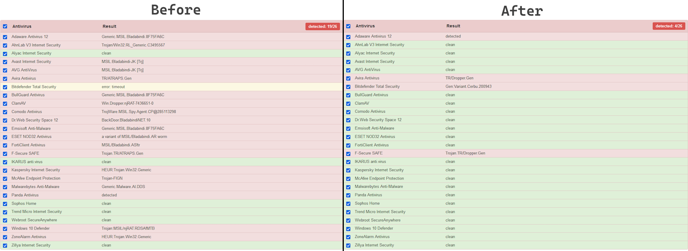

  
   

# SimpleCrypter [.NET/Native]   <a href="https://github.com/bytenano/SimpleCrypter/releases/latest"> </img> </a> <a href="#"> </img> </a> <a href="https://github.com/bytenano/BinaryToBytes-B2B/commits/master"> </img> </a> <a href="#license"> </img> </a>

A simple cryptor for .NET/Native files with Injection and obfuscation

<h2 align="center">Preview</h2>

  

### Features:

• Anti-Debug  
• Anti-VM  
• StartUp  
• Melting  
• Running as Admin  

### Tech-part:

• Injection PE  
• .NET Reactor implemented  

<h2 align="center">Scantime Result</h2>

  

### Warning!
_This software created for the purpose of learning for beginners in information security and malware analysis. If you actually try to distribute VIRUSES that are encrypted by SimpleCrypter, you are only responsible for yourself. We are not responsible for the use of our crypto protector for illegal purposes. The source code is published to assist government agencies. We are against the use of our software for illegal purposes._

### Credits:
Nano — https://t.me/uxnano  
Dnlib (0xd4d) — https://github.com/0xd4d/dnlib  
Costura.Fody (Fody) - https://github.com/Fody/Costura  
Eziriz .NET Reactor - https://www.eziriz.com/dotnet_reactor.htm  
